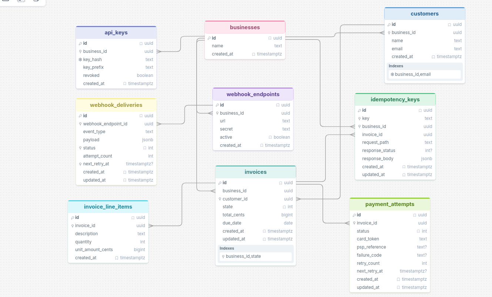

# DESIGN.md

## 1. Data Model

### ER Diagram



### Tables

**businesses**
- `id` UUID PK, `name` TEXT, `created_at` TIMESTAMPTZ
- One business owns all other resources. UUID over serial to prevent enumeration attacks and to work safely across distributed systems.

**api_keys**
- `id` UUID PK, `business_id` FK, `key_hash` TEXT, `key_prefix` TEXT, `revoked` BOOL
- Separate table from businesses so one business can have multiple keys and revoke them individually without touching the business record.
- `UNIQUE(key_hash)` — every auth request hashes the bearer token and does a point lookup here, so this index is on the hot path for every single request.

**customers**
- `id` UUID PK, `business_id` FK, `name` TEXT, `email` TEXT, `created_at` TIMESTAMPTZ
- `UNIQUE(business_id, email)` — no duplicate emails per business, but two businesses can share the same customer email. Constraint is composite, not global.
- Index on `business_id` for `LIST /customers`.

**invoices**
- `id` UUID PK, `business_id` FK, `customer_id` FK, `state` ENUM, `total_cents` BIGINT, `due_date` DATE `created_at` TIMESTAMPZ `updated_at` TIMESTAMPZ
- `total_cents` computed server-side from line items. Client-supplied total is never trusted.
- Composite index on `(business_id, state)` — leading column is `business_id` because every query is scoped to a business first. `state` alone has poor selectivity (6 values). A single-column index on `state` would be ignored by the planner.
- Known gap: no `CHECK (total_cents > 0)` at DB level. Enforced in handler only.

**invoice_line_items**
- `id` UUID PK, `invoice_id` FK, `description` TEXT, `quantity` INT CHECK (> 0), `unit_amount_cents` BIGINT CHECK (> 0), `created_at` TIMESTAMPZ
- Constraints enforced at DB level. `quantity` and `unit_amount_cents` cannot be zero or negative.
- Index on `invoice_id` for fetching line items with an invoice.

**payment_attempts**
- `id` UUID PK, `invoice_id` FK, `status` ENUM (pending/succeeded/failed), `card_token` TEXT, `psp_reference` TEXT nullable, `failure_code` TEXT nullable, `retry_count` INT, `next_retry_at` TIMESTAMPZ, `created_at` TIMESTAMPZ, `updated_at` TIMESTAMPZ
- Created as `pending` before the PSP call. This records that a charge was attempted even if the PSP never responds. Every attempt is kept regardless of outcome — full audit trail.
- Index on `invoice_id`.

**idempotency_keys**
- `id` UUID PK, `key` TEXT, `business_id` FK, `response_status` INT nullable, `response_body` JSONB, `updated_at` TIMESTAMPTZ, `created_AT` TIMESTAMPZ
- `UNIQUE(key, business_id, invoice_id)` — keys are scoped per business and invoice. Business A's key "pay-123" for invoice X does not conflict with the same key used for invoice Y, or with Business B's "pay-123"..
- `response_status` is nullable. `NULL` means the request started but the server crashed before the PSP responded. Only records with `response_status IS NOT NULL` are replayed. This prevents a crashed in-flight request from being replayed as a stale pending response forever.
- Index on `(key, business_id)` — created automatically by the unique constraint.

**webhook_endpoints**
- `id` UUID PK, `business_id` FK, `url` TEXT, `secret` TEXT, `active` BOOL, `created_at` TIMESTAMPZ
- Secret generated at creation (`whsec_{uuid}`), used for HMAC signing. Never regenerated — rotation requires creating a new endpoint.

**webhook_deliveries**
- `id` UUID PK, `webhook_endpoint_id` FK, `event_type` TEXT, `payload` JSONB, `status` ENUM (pending/delivered/failed), `attempt_count` INT, `next_retry_at` TIMESTAMPTZ, `created_at` TIMESTAMPZ, `updated_at` TIMESTAMPZ
- Acts as a job queue for the webhook worker. Index on `(status, next_retry_at)` so the worker can efficiently poll for due deliveries.

### At 100x scale
- Partition `invoices` and `payment_attempts` by `business_id` — largest tables, most queries are already scoped by business.
- Move `webhook_deliveries` and `payment_attempts` off Postgres entirely into a dedicated queue (SQS, Redis Streams). Polling a DB table as a job queue works at small scale but becomes a bottleneck — the worker query hits the index constantly and competes with write traffic.
- Add read replicas — all `GET` endpoints can go to a replica. Writes stay on primary.
- Cache `api_keys` lookups in Redis with a ~60s TTL. Every single request currently does a DB lookup on `key_hash`. At high volume this is a hot row that benefits from an in-memory cache.
- Add `PgBouncer` in front of Postgres. Current pool is `max_connections: 5` — fine for a demo but a pooler is required at scale.

---

## 2. Invoice State Machine

```
         POST /finalize
draft ─────────────────► open
  │                       │  │
  │ POST /void            │  │ POST /pay
  │                       │  ▼
  │              POST /void  processing ──► paid (terminal)
  │                       │       │
  ▼                       │       │ PSP fail/timeout
void (terminal) ◄─────────┘       │
                                   ▼
                                  open  (reset, retry allowed)
                                   │
                                   │ manual mark
                                   ▼
                          uncollectible (terminal)
```

### State transition table

| From | To | Trigger |
|------|----|---------|
| `draft` | `open` | `POST /invoices/:id/finalize` |
| `draft` | `void` | `POST /invoices/:id/void` |
| `open` | `processing` | `POST /invoices/:id/pay` called |
| `open` | `void` | `POST /invoices/:id/void` |
| `open` | `uncollectible` | manual mark (no endpoint yet) |
| `processing` | `paid` | PSP returns success |
| `processing` | `uncollectible` | manual mark (no endpoint yet) |

**Terminal states**: `paid`, `void`, `uncollectible`. No transitions out.

**How invalid transitions are rejected**: `InvoiceState::can_transition_to()` is called before every state change. Any transition not in the table above returns HTTP 422 with error code `invalid_state_transition`. No DB write occurs.

---

## 3. Payment Correctness & Failure Modes

### (a) Two concurrent POST /pay requests for the same invoice

Both requests enter a transaction and attempt `SELECT ... FOR UPDATE` on the invoice row. Postgres grants the lock to one and blocks the other.

Request A proceeds: state is `open`, transitions to `processing`, inserts a `pending` payment attempt, inserts the idempotency key with `response_status = NULL`, commits.

Request B now acquires the lock: reads state as `processing`, a strict check for state as `open` returns false, returns 422. PSP is never called for B.

**Guarantee**: the `FOR UPDATE` row-level lock. Only one transaction can hold it at a time. The invoice row is the mutex.

### (b) PSP timeout (tok_timeout, 30s)

Our PSP client enforces a 5-second timeout via 
`tokio::time::timeout`. After 5 seconds with no response:

- Invoice stays in `processing`
- `payment_attempt` stays as `pending`
- Endpoint returns HTTP `202 Accepted`

Both states are intentionally left unchanged — they honestly reflect that a charge is in-flight with unknown outcome. Reverting the invoice to `open` would be a lie — we don't know if the PSP charged the card.
The `202` signals to the caller that the outcome is unknown. The caller should NOT retry with a new payment — the invoice is `processing` and will reject further payment attempts until the reconciliation worker resolves it.

The reconciliation worker queries the PSP for the outcome and resolves both the invoice state and payment attempt atomically in a single transaction. They must never disagree.

### (c) PSP returns success, service crashes before persisting

The payment attempt is written as `pending` inside the first transaction — before the PSP is called. If the service crashes after the PSP succeeds but before `tx2` commits:

- Invoice is stuck in `processing`
- Payment attempt is stuck as `pending`
- The customer has been charged

On retry with the same idempotency key: the record is found with response_status = NULL (written before PSP call). The pending attempt body is returned as cached response. The caller receives the pending attempt and believes the 
payment is in-flight. The invoice remains stuck in processing until a reconciliation worker resolves it The customer is not charged twice as PSP was called once.

### Retry policy

Exponential backoff. Delay formula: `2^attempt_count minutes`.

| Attempt | Delay after previous failure |
|---------|------------------------------|
| 1 | immediate |
| 2 | 2 minutes |
| 3 | 4 minutes |
| 4 | 8 minutes |
| 5 (final) | 16 minutes |

Each attempt times out after 5 seconds. A non-2xx response or connection failure does not count as failure. Keeps on retrying until a definite result is obtained from the PSP or until it crosses the 24 hour limit after which the payment attempt is marked as `failed` and the invoice is reverted to `open`.

### (d) Idempotency key reused with different request body

We return the cached response and ignore the body difference. This matches Stripe's documented behavior. The idempotency key is a client-supplied lock token for an operation — if you reuse it, you get the original result back regardless of what you send. It is the caller's responsibility to use a fresh key for a genuinely different request.

We do not return an error. Returning 422 on body mismatch is an alternative, but it adds complexity (body hashing and storage) for a case that is almost always a client bug rather than an intentional different request.

### (e) Invoice in paid state receives POST /pay

`FOR UPDATE` lock acquired. State read as `paid`. `can_transition_to(Processing)` returns false. Returns HTTP 422 with `invalid_state_transition`. PSP is never called.

### Concurrency mechanism: pessimistic row-level lock

`SELECT ... FOR UPDATE` was chosen over the alternatives:

FOR UPDATE was chosen because the invoice row is a shared resource modified by multiple handlers — /pay, /void, /finalize. Any of these running concurrently on the same invoice could cause data mismatches. FOR UPDATE ensures only one handler holds the invoice at a time regardless of which operation it is. 
Advisory locks would be an equivalent alternative — lock on the invoice ID integer, same mutual exclusion, slightly more explicit. 
Status-conditional and optimistic approaches only protect against concurrent /pay calls but not against /void racing with /pay mid-flight.

---

## 4. Webhook Design

### Signing scheme

HMAC-SHA256 over the raw JSON request body using the endpoint's `secret` as the key. Signature delivered as:

```
X-Webhook-Signature: sha256=<hex-encoded-hmac>
```

Receiver recomputes `HMAC-SHA256(secret, body)` and compares using a constant-time comparison. Mismatch → reject.

**Replay protection (known gap)**: the current implementation signs the body only. A captured webhook can be replayed indefinitely. Production fix: include a timestamp in the signed string — `HMAC-SHA256(secret, timestamp + "." + body)` — and have receivers reject events with a timestamp older than 5 minutes. Not implemented; documented here for receivers.

### Retry policy

Exponential backoff. Delay formula: `2^attempt_count minutes`.

| Attempt | Delay after previous failure |
|---------|------------------------------|
| 1 | immediate |
| 2 | 2 minutes |
| 3 | 4 minutes |
| 4 | 8 minutes |
| 5 (final) | 16 minutes |

Total budget: ~30 minutes from first delivery attempt. Each attempt times out after 5 seconds. A non-2xx response or connection failure counts as a failure.

After 5 attempts the delivery is marked `failed` in `webhook_deliveries`. No further retries.

### Exhausted retries and reconciliation

Failed deliveries remain in `webhook_deliveries` permanently as an audit record. A business can reconcile missed events by polling `GET /invoices?state=paid` — the invoice state is the source of truth, not the webhook. A future `GET /webhooks/deliveries` endpoint would surface failed deliveries directly.

### Why decoupled from the API response

Webhook delivery runs inside `tokio::spawn` after the API response is returned. The reasons:

1. **Latency**: a synchronous delivery would add the receiver's response time (up to 5s) to our API latency.
2. **Reliability**: a slow or down receiver would cause our API to time out. Our API availability should not depend on the receiver's availability.
3. **Retries**: async delivery enables a retry queue. Synchronous delivery has no natural retry path.

The tradeoff: `tokio::spawn` is fire-and-forget. If the process crashes immediately after spawning, the webhook task is lost. A more robust approach queues the delivery record first (we do write to `webhook_deliveries` before spawning), then the worker picks it up. Our implementation does this correctly — the DB record is written inside the handler transaction, the spawn just triggers the first delivery attempt.

---

## 5. API Key Model

- **Generation**: `sk_live_{uuid_v4_no_hyphens}` — 128 bits of entropy from UUID v4. Prefixed for easy identification in logs and support tickets.
- **Storage**: SHA-256 hash stored in `api_keys.key_hash`. Raw key never persisted anywhere.
- **Transmission**: shown to the caller exactly once in the `POST /businesses` response. Must be saved immediately — there is no recovery path.
- **Lookup**: every request hashes the `Authorization: Bearer` token with SHA-256 and does an indexed point lookup on `key_hash`. One DB query per request, no plaintext comparison.
- **Prefix**: first 16 characters stored as `key_prefix` (`sk_live_xxxxxxxx`) so keys can be identified in listings without exposing the full key.
- **Rotation**: create a new key via `POST /businesses` (future: `POST /api_keys`), update integrations, then revoke the old key. Zero-downtime rotation is possible by running both keys in parallel briefly.
- **Revocation**: `UPDATE api_keys SET revoked = true WHERE id = $1`. Next request using that key gets 401. Immediate effect.
- **Blast radius if leaked**: only affects one business. The leaked key cannot access any other business's data. Revoke immediately and generate a new key.

**Known gap**: no endpoint to list or revoke individual keys. Revocation currently requires a direct DB update. A `GET /api_keys` and `DELETE /api_keys/:id` endpoint would be needed in production.

---

## 6. What I Cut and Why

1. **Refunds** — significant state machine complexity (partial refunds, full refunds, refund failures). Would add a `refunds` table, a `refunded` invoice state, and PSP refund calls. Out of scope per spec.

2. **Rate limiting** — would use a sliding window counter in Redis keyed by `api_key_id`. Requires Redis infrastructure. Discussed in production gaps instead.

3. **Pagination** — list endpoints return all records. At scale, cursor-based pagination on `(created_at, id)` would be required to avoid unbounded result sets.

4. **Webhook delivery viewer** — no `GET /webhooks/deliveries` endpoint. Businesses cannot currently inspect failed deliveries via API. The data exists in `webhook_deliveries` but is not exposed.

5. **Stronger webhook replay protection** — current signature covers body only, no timestamp. Replay attacks are possible. Fix is `HMAC(secret, timestamp + "." + body)` with receiver-side timestamp validation.

6. **Discounts and credits** — no discount or coupon system. Negative line item amounts are blocked by CHECK constraint. Production would model discounts as a separate`invoice_discounts` table with positive amounts subtracted from the line item total, keeping all values positive throughout the money path.

---

## 7. Production Readiness Gaps

1. **Observability** — no metrics (Prometheus/StatsD), no distributed tracing (OpenTelemetry). In production every PSP call, state transition, and webhook delivery should emit a span and a counter. Without this, debugging a stuck invoice in production is very hard.

3. **Rate limiting** — no protection against API abuse. A leaked key could generate unbounded requests. A sliding window rate limiter per `api_key_id` (Redis) is needed before this handles real traffic.